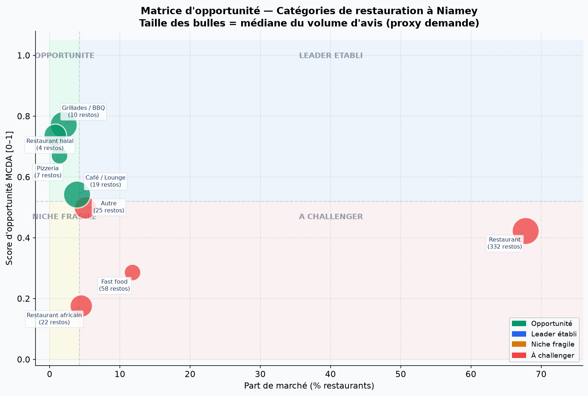
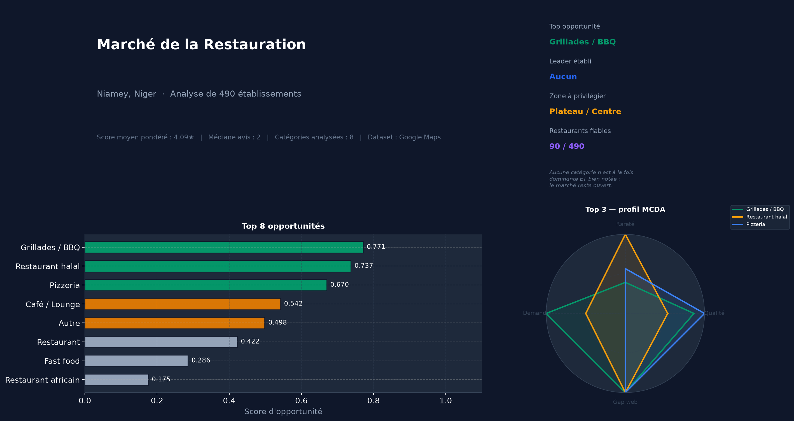

# 🍽️ Analyse du marché de la restauration à Niamey

> **Où — et quel type de restaurant — ouvrir à Niamey pour maximiser ses chances de succès ?**
> Une analyse de données de bout en bout sur 490 établissements issus de Google Maps, du nettoyage brut jusqu'à un modèle de décision déployable.

[](https://python.org)
[](https://pandas.pydata.org)
[](https://duckdb.org)
[](https://scikit-learn.org)
[](https://python-visualization.github.io/folium/)
[](LICENSE)

---

## 🗺️ Carte interactive

👉 **[Ouvrir la carte en ligne](https://blakro.github.io/Niamey_restaurants_analysis/map_PORTFOLIO.html)**
*(marqueurs par score · carte de densité · carte de qualité · zones DBSCAN)*

> Carte servie via GitHub Pages (Settings → Pages → branche `main`, dossier `/docs`).

---

## 🔑 Principaux enseignements

| # | Constat |
|---|---------|
| 1 | **72 %** des restaurants se situent entre 3,5 et 4,9 étoiles — perception globalement positive du marché. |
| 2 | **~78 restaurants** affichent 5,0★ mais sur ≤ 5 avis — une moyenne bayésienne corrige ce biais de petit échantillon. |
| 3 | **La médiane est de 3 avis** — 60 % des établissements ont moins de 10 avis, signe d'un marché très informel. |
| 4 | Les restaurants **disposant d'un site web** obtiennent un meilleur score moyen (Mann-Whitney U, p < 0,05). |
| 5 | Les meilleures opportunités sont les catégories **sous-représentées mais bien notées** (cf. modèle MCDA). |
| 6 | **Aucun « leader établi »** (catégorie à la fois dominante et bien notée) — le marché reste ouvert. |

---

## 🧭 Méthodologie

Un pipeline en quatre étapes, chaque notebook consommant la sortie du précédent :

| Notebook | Rôle | Techniques clés |
|----------|------|-----------------|
| **`01_cleaning`** | Normalisation du schéma, audit des valeurs manquantes, déduplication, feature engineering | **Moyenne bayésienne**, paliers de fiabilité, score de complétude |
| **`02_eda`** | Distributions, analyse par catégorie, corrélations, tests d'hypothèses | **DuckDB SQL**, Spearman, **Kruskal-Wallis + Bonferroni** |
| **`03_geospatial`** | Géocodage, clustering spatial, cartes interactives | **Décodage des Plus Codes**, **DBSCAN**, fusion hiérarchique en méta-zones, Folium |
| **`04_market_gaps`** | Modèle de décision multicritère & recommandations | **MCDA** (scoring pondéré), matrice d'opportunité, rapport auto-généré |

---

## 📊 Aperçus

| Matrice d'opportunité | Tableau de bord décisionnel |
|:---:|:---:|
|  |  |

---

## 📁 Structure du dépôt

```
Niamey_restaurants_analysis/
├── README.md
├── requirements.txt
├── LICENSE
├── data/
│   ├── raw/                      # CSV source (export Google Maps)
│   └── processed/                # généré par les notebooks (ignoré par git)
│       ├── figures/              # tous les graphiques (PNG)
│       └── maps/                 # cartes Folium (HTML)
├── notebooks/
│   ├── 01_cleaning.ipynb
│   ├── 02_eda.ipynb
│   ├── 03_geospatial.ipynb
│   └── 04_market_gaps.ipynb
└── docs/
    └── map_PORTFOLIO.html        # servie via GitHub Pages
```

---

## ⚙️ Reproduire en local

```bash
git clone https://github.com/blakro/Niamey_restaurants_analysis
cd Niamey_restaurants_analysis

python -m venv .venv && source .venv/bin/activate   # Windows : .venv\Scripts\activate
pip install -r requirements.txt

jupyter lab        # exécuter les notebooks 01 → 04 dans l'ordre
```

Le notebook de nettoyage télécharge le jeu de données automatiquement ; tout le reste en est régénéré.

---

## 🛠️ Stack technique

`Python` · `pandas` · `NumPy` · `SciPy` · `DuckDB (SQL)` · `scikit-learn` ·
`Matplotlib` · `seaborn` · `Folium` · `openlocationcode`

---

## 📄 Licence

Publié sous licence MIT — voir [`LICENSE`](LICENSE).
*Source des données : fiches publiques Google Maps, Niamey, Niger.*
